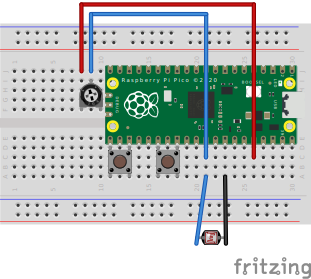
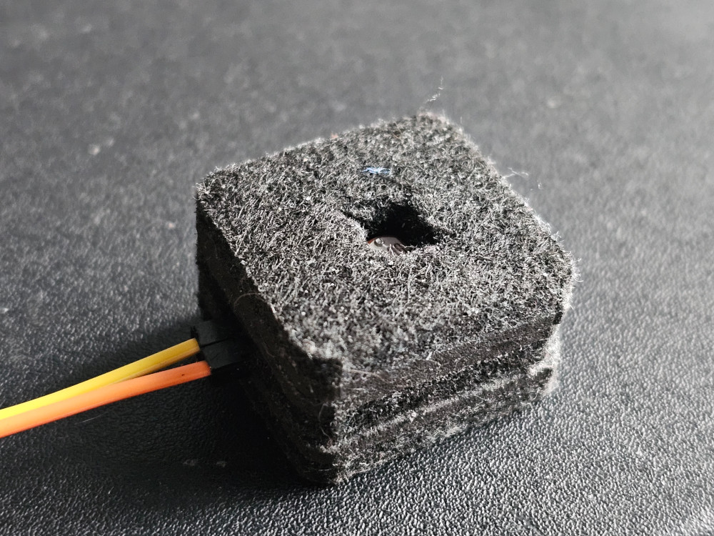

# Example setup

By default macro_pin and button_pin are set up so it's easy to get working on a breadboard. You can of course use any gpio pin for the buttons but make sure to change the value in main.cpp.

Feel free to change the potentiometer to get a good range of data out of your specific light sensor. Or like me, you can add a resistor in series. This will still let you control the gain of the sensor to some extent.

You should encapsulate the sensor so that no light gets from the outside. The light sensor's cable should be long enough to let you position it on the monitor.